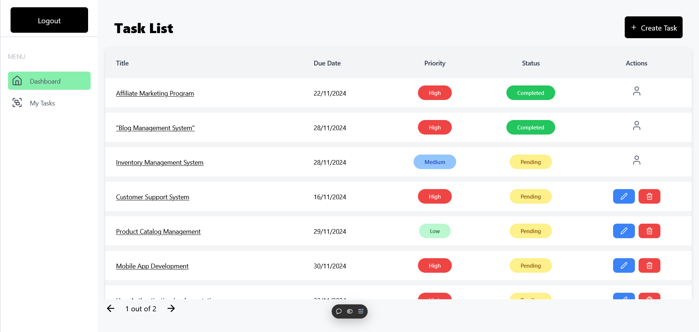

# Taskify ⭐ 🌟



## Getting Started

To get started with Taskify, follow these steps:

### Prerequisites

Ensure you have [Node.js](https://nodejs.org/) installed on your machine.

### Installation

1. **Clone the repository:**

   ```bash
   https://github.com/hritikpathak06/Taskify.git
   ```

**For Server**

```bash
cd server
npm install
npm run dev
```

**FOR SERVER LOCAL**

```bash
cd server/index.js
change the cors setting to localhost
just uncomment the origin
```

**For Client**

```bash
cd client
npm install
npm run dev
```

**FOR CLIENT LOCAL**

```bash
cd client/src/config/url.ts
change the BASE_URL  to localhost
just uncomment the BASE_URL
```